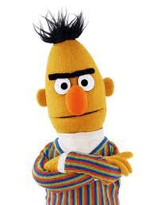

# DiffusionBERT

Official implementation of [DiffusionBERT: Improving Generative Masked Language Models with Diffusion Models](https://arxiv.org/abs/2211.15029).
Please check out our paper for more details.

Work in progress. We will release the complete code upon exploring more tasks and applications.

### Update

**2022.11.30** Initial commit.

### Abstract
We present DiffusionBERT, a new generative masked language model based on discrete diffusion models.
Diffusion models and many pre-trained language models have a shared training objective, i.e., \textit{denoising}, making it possible to combine the two powerful models and enjoy the best of both worlds. 
On the one hand, diffusion models offer a promising training strategy that helps improve the generation quality.
On the other hand, pre-trained denoising language models (e.g., BERT) can be used as a good initialization that accelerates convergence.
We explore training BERT to learn the reverse process of a discrete diffusion process with an absorbing state and elucidate several designs to improve it.
First, we propose a new noise schedule for the forward diffusion process that controls the degree of noise added at each step based on the information of each token.
Second, we investigate several designs of incorporating the time step into BERT.
Experiments on unconditional text generation demonstrate that DiffusionBERT achieves significant improvement over existing diffusion models for text (e.g., D3PM and Diffusion-LM) and previous generative masked language models in terms of perplexity and BLEU score.
